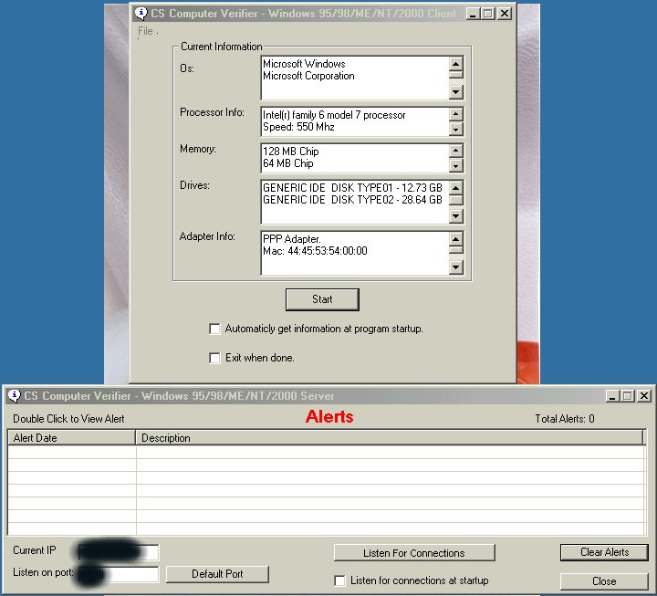



## CS Computer Verifier for Win95/98/ME/NT/2000

### Description

You need to have WMI 1.5 installed by Microsoft. You can get this from my homepage, it is free from Microsoft. This is for all Windows Versions. Client/Server version, both included. Ever needed to keep an eye on hardware on your systems at work? Afraid employees will try to take or switch hardware from there PC's? Keep an eye on Operating System Information, Processor Information, Memory Information, Hard Drive Information, and Adapter Information. This will keep the data found in a database and every time you want to verify that the information is still correct, it will check the pc then compare it to the saved data. If any data doesn't match it will give a alert message, telling you that someone may have played with the hardware. A great security program!
 
### More Info
 

             |
---                |---
**Submitted On**   |2000-11-03 19:02:30
**By**             |[Shane Croft](https://github.com/Planet-Source-Code/PSCIndex/blob/master/ByAuthor/shane-croft.md)
**Level**          |Intermediate
**User Rating**    |4.3 (34 globes from 8 users)
**Compatibility**  |VB 6\.0
**Category**       |[Complete Applications](https://github.com/Planet-Source-Code/PSCIndex/blob/master/ByCategory/complete-applications__1-27.md)
**World**          |[Visual Basic](https://github.com/Planet-Source-Code/PSCIndex/blob/master/ByWorld/visual-basic.md)
**Archive File**   |[CODE\_UPLOAD112691132000\.zip](https://github.com/Planet-Source-Code/shane-croft-cs-computer-verifier-for-win95-98-me-nt-2000__1-12510/archive/master.zip)

